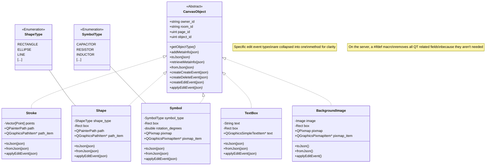
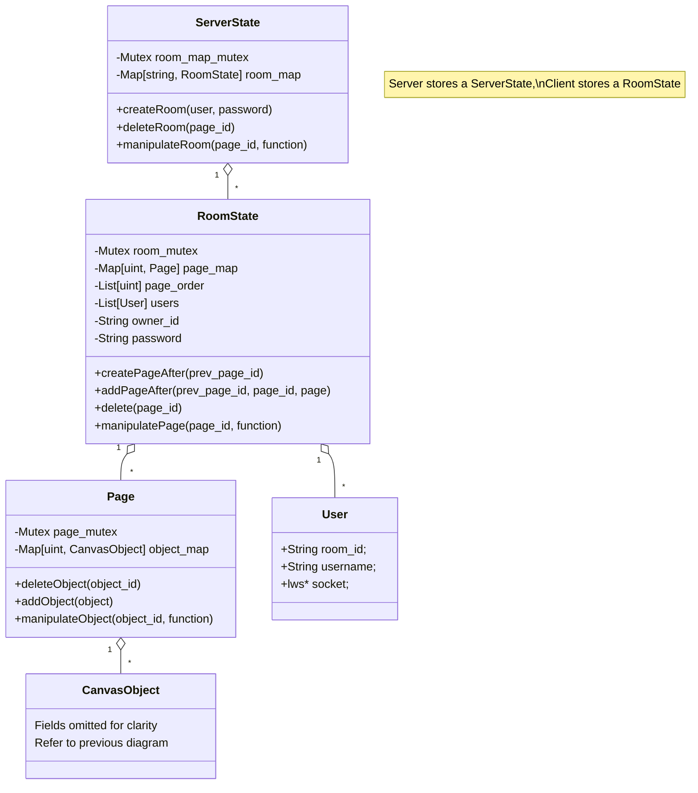
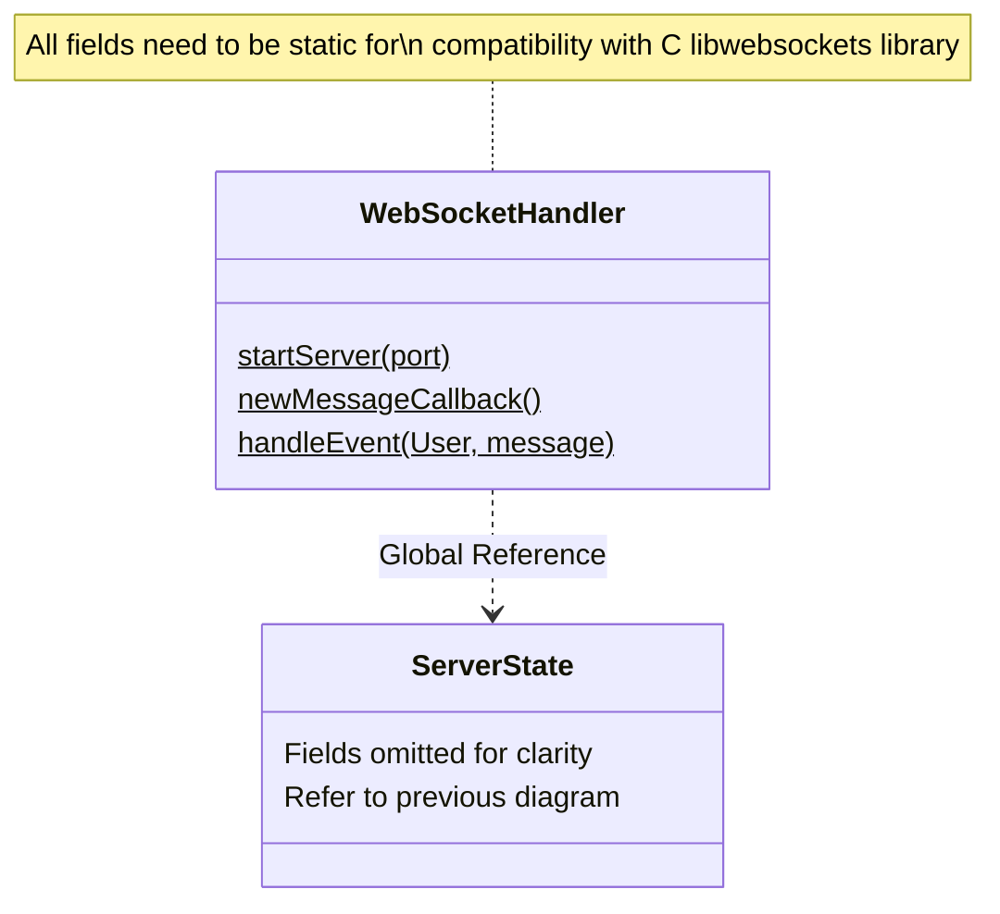
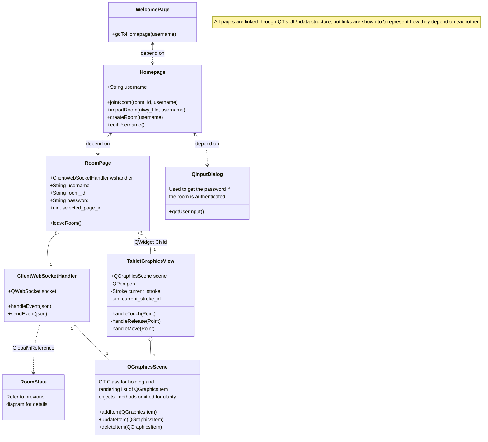

# Class Diagrams
## CanvasObject Class Diagram

```mermaid
classDiagram
  %% direction TB
  direction TB
  note "Specific edit event types\nare collapsed into one\nmethod for clarity"
  note "On the server, a #ifdef macro\nremoves all QT related fields\nbecause they aren't needed"
  class CanvasObject {
    <<Abstract>>
    +string owner_id
    +string room_id
    +uint page_id
    +uint object_id
    +getObjectType()*
    +addMetaInfo(json)
    +toJson(json)*
    +retrieveMetaInfo(json)
    +fromJson(json)*
    +createCreateEvent(json)
    +createDeleteEvent(json)
    +createEditEvent(json)
    +applyEditEvent(json)*
  }
  CanvasObject <|.. Stroke
  class Stroke {
    -Vector[Point] points
    +QPainterPath path
    +QGraphicsPathItem* path_item
    +toJson(json)
    +fromJson(json)
    +applyEditEvent(json)
  }
  class ShapeType {
    <<Enumeration>>
    RECTANGLE
    ELLIPSE
    LINE
    [...]
  }
  ShapeType -- Shape
  CanvasObject <|.. Shape
  class Shape {
    -ShapeType shape_type
    -Rect box
    +QPainterPath path
    +QGraphicsPathItem* path_item
    +toJson(json)
    +fromJson(json)
    +applyEditEvent(json)
  }
  class SymbolType {
    <<Enumeration>>
    CAPACITOR
    RESISTOR
    INDUCTOR
    [...]
  }
  SymbolType -- Symbol
  CanvasObject <|.. Symbol
  class Symbol {
    -SymbolType symbol_type
    -Rect box
    -double rotation_degrees
    +QPixmap pixmap
    +QGraphicsPixmapItem* pixmap_item
    +toJson(json)
    +fromJson(json)
    +applyEditEvent(json)
  }
  CanvasObject <|.. TextBox
  class TextBox {
    -String text
    -Rect box
    +QGraphicsSimpleTextItem* text
    +toJson(json)
    +fromJson(json)
    +applyEditEvent(json)
  }
  CanvasObject <|.. BackgroundImage
  class BackgroundImage {
    -Image image
    -Rect box
    +QPixmap pixmap
    +QGraphicsPixmapItem* pixmap_item
    +toJson()
    +fromJson()
    +applyEditEvent()
  }
```

## ServerState and RoomState Class Diagram

```mermaid
classDiagram
  
  note "Server stores a ServerState,\nClient stores a RoomState"
  ServerState "1" o-- "*" RoomState
  class ServerState {
    -Mutex room_map_mutex
    -Map[string, RoomState] room_map
    +createRoom(user, password)
    +deleteRoom(page_id)
    +manipulateRoom(page_id, function)
  }
  RoomState "1" o-- "*" Page
  class RoomState {
    -Mutex room_mutex
    -Map[uint, Page] page_map
    -List[uint] page_order
    -List[User] users
    -String owner_id
    -String password
    +createPageAfter(prev_page_id)
    +addPageAfter(prev_page_id, page_id, page)
    +delete(page_id)
    +manipulatePage(page_id, function)
  }
  Page "1" o-- "*" CanvasObject
  class Page {
    -Mutex page_mutex
    -Map[uint, CanvasObject] object_map
    +deleteObject(object_id)
    +addObject(object)
    +manipulateObject(object_id, function)
  }
  RoomState "1" o-- "*" User
  class User {
    +String room_id;
    +String username;
    +lws* socket;
  }
  class CanvasObject {
    Fields omitted for clarity
    Refer to previous diagram
  }
```

## Server Class Diagram

```mermaid
classDiagram
  note for WebSocketHandler "All fields need to be static for\n compatibility with C libwebsockets library" 
  WebSocketHandler ..> ServerState : Global Reference
  class WebSocketHandler{
    startServer(port)$
    newMessageCallback()$
    handleEvent(User, message)$
  }
  class ServerState{
    Fields omitted for clarity
    Refer to previous diagram
  }
```

## Client Class Diagram

```mermaid
classDiagram
  direction TB
  note "All pages are linked through QT's UI \ndata structure, but links are shown to \nrepresent how they depend on eachother"
  class WelcomePage{
    +goToHomepage(username)
  }
  WelcomePage <..> Homepage : depend on
  class Homepage{
    +String username
    +joinRoom(room_id, username)
    +importRoom(ntwy_file, username)
    +createRoom(username)
    +editUsername()
  }
  RoomPage "1" o-- "1" ClientWebSocketHandler
  RoomPage "1" o-- "1" TabletGraphicsView : QWidget Child
  Homepage <..> RoomPage : depend on 
  
  
  Homepage <..> QInputDialog : depend on
  class QInputDialog {
    Used to get the password if 
    the room is authenticated
    +getUserInput()
  }
  class RoomPage{
    +ClientWebSocketHandler wshandler
    +String username
    +String room_id
    +String password
    +uint selected_page_id
    +leaveRoom()
  }
  class TabletGraphicsView {
    -handleTouch(Point)
    -handleRelease(Point)
    -handleMove(Point)
    +QGraphicsScene scene
    -QPen pen

    -Stroke current_stroke
    -uint current_stroke_id
  }
  class RoomState {
    Refer to previous
    diagram for details
  }
  ClientWebSocketHandler ..> RoomState : Global\nReference
  TabletGraphicsView "1" o-- "1" QGraphicsScene
  ClientWebSocketHandler "1" o-- "1" QGraphicsScene
  class ClientWebSocketHandler{
    +QWebSocket socket

    +handleEvent(json)
    +sendEvent(json)
  }
  class QGraphicsScene {
    QT Class for holding and
    rendering list of QGraphicsItem
    objects, methods omitted for clarity
    +addItem(QGraphicsItem)
    +updateItem(QGraphicsItem)
    +deleteItem(QGraphicsItem)
  }
```