# Sequence Diagrams

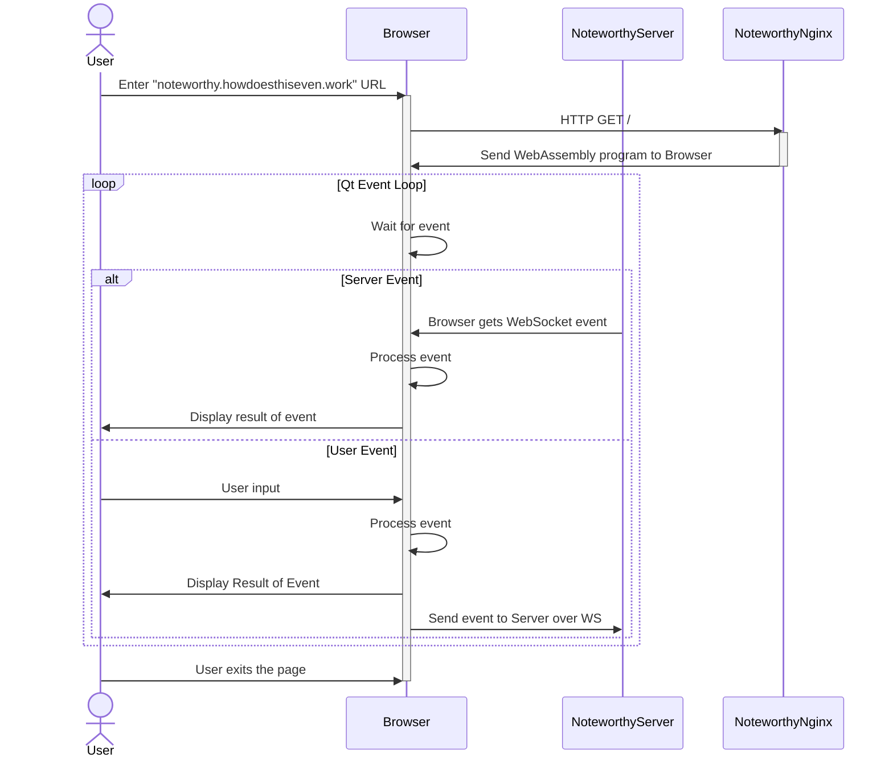

## Enter name
-	Enter name
    -	Brings you to home page
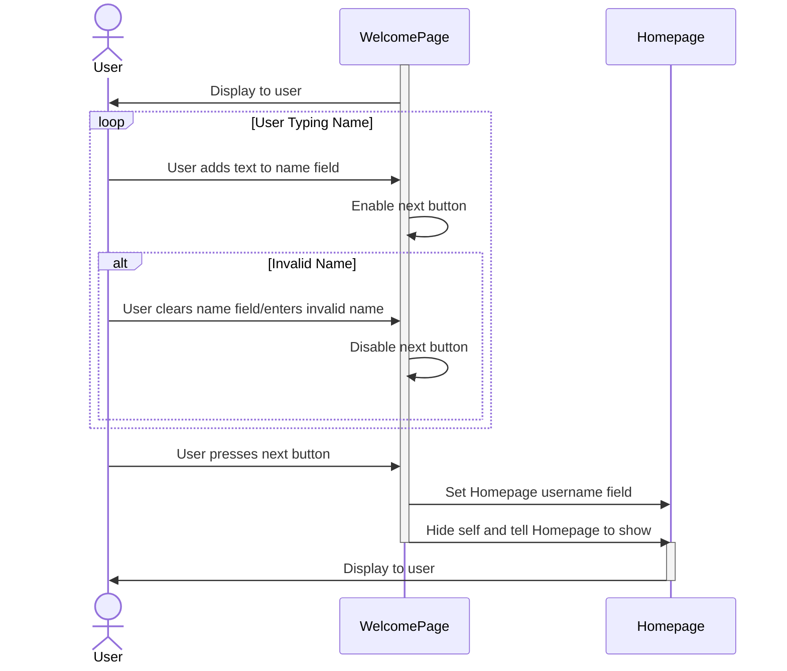
## Change name
-	Brings you back to welcome page
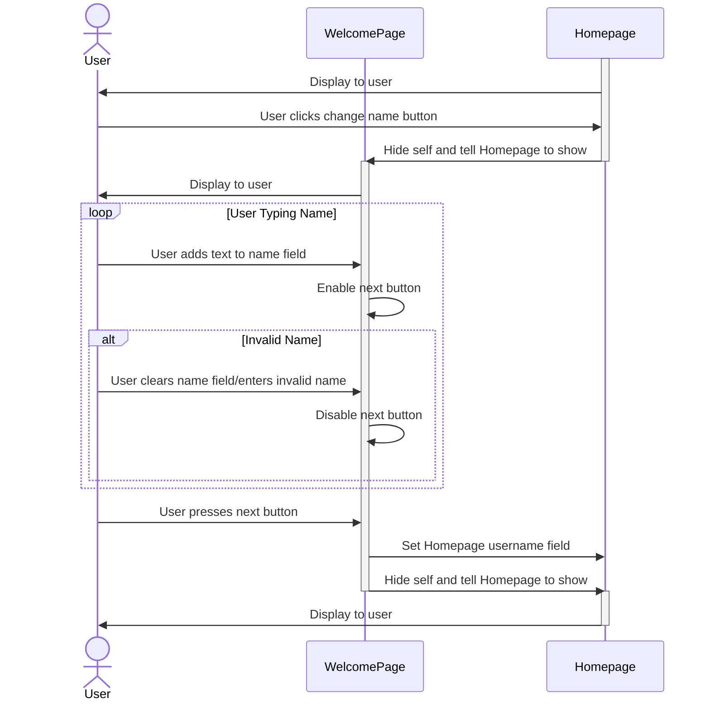
## Create New Room
-	Create New Room
    -	Brings you to Room page
    -	Password dialog
    -	Makes you owner
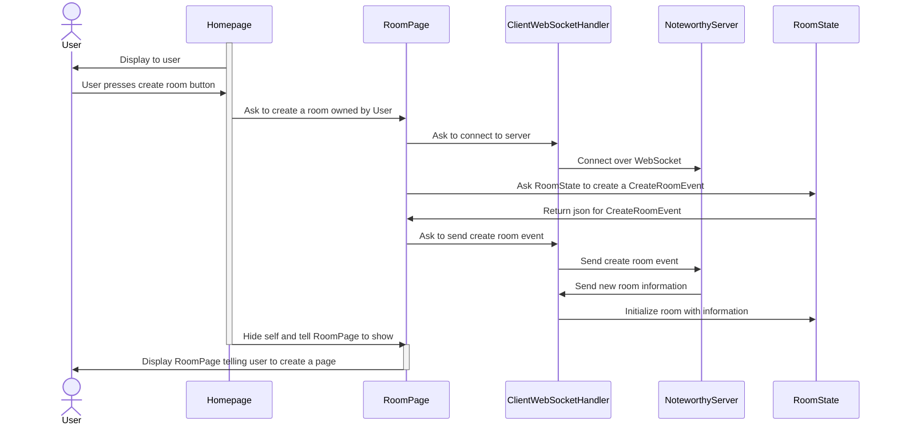
-	Import Room from Noteworthy File
    -	Imports state of a previously exported room
    -	Brings you to Room Editor page
    -	Makes you owner
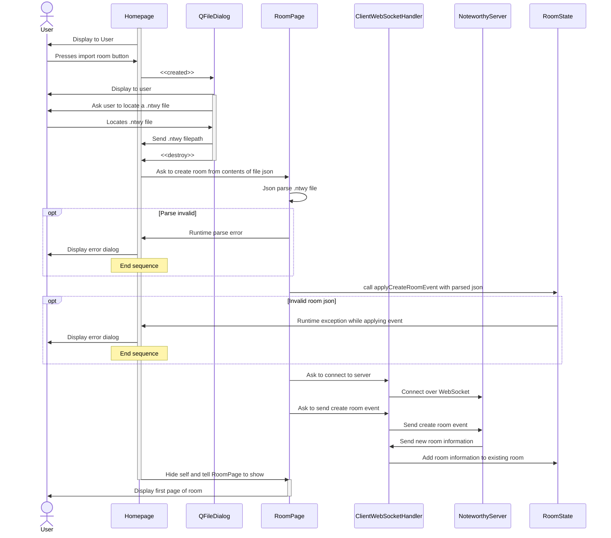
-	Join Room
    -	Brings you to Room Editor page
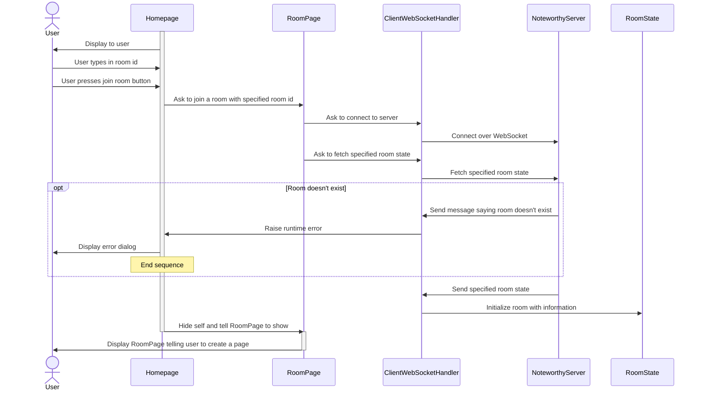
## User does Action
### User who did the action
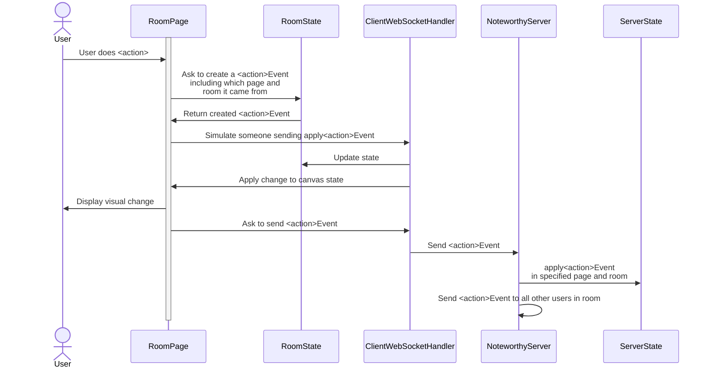
### Other users in room
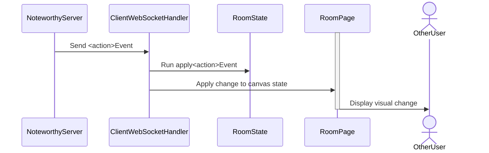
## Receive kick event
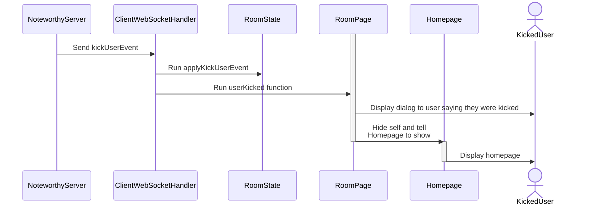
## Change Room Owner
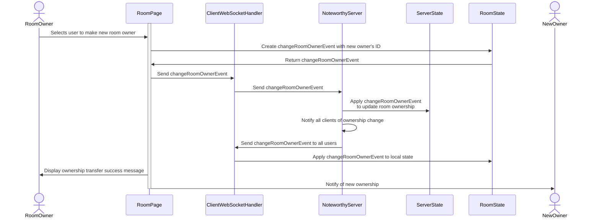
## Export Room as PDF
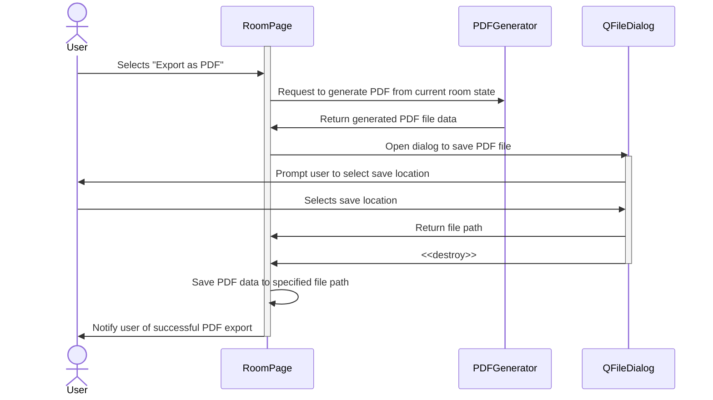
## Export Room as Noteworthy File
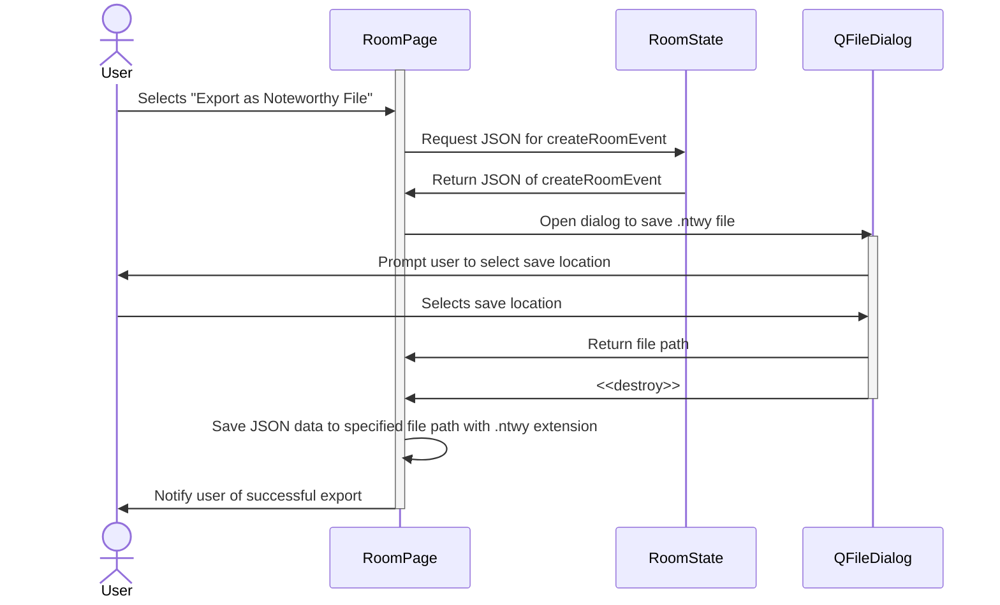
-	
-	Export Room as Noteworthy File
