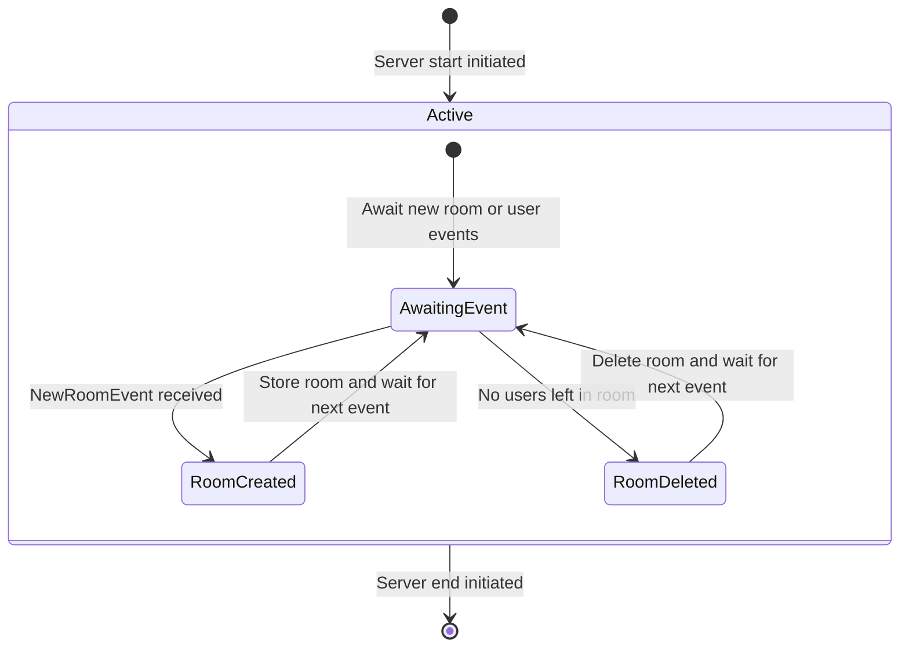
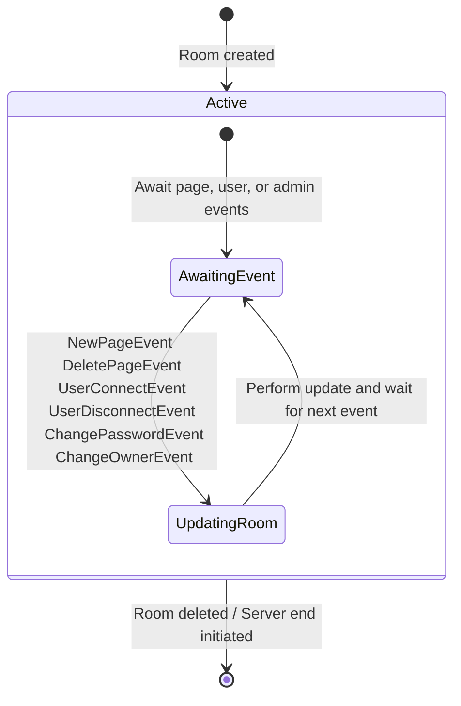
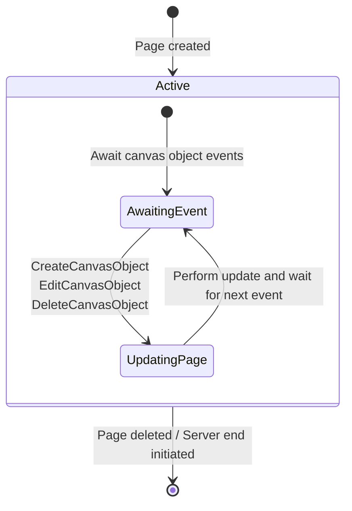

# State Diagrams
## ServerState Object

```mermaid
stateDiagram-v2
    [*] --> Active : Server start initiated
    
    state Active {
        [*] --> AwaitingEvent : Await new room or user events

        AwaitingEvent --> RoomCreated : NewRoomEvent received
        RoomCreated --> AwaitingEvent : Store room and wait for next event

        AwaitingEvent --> RoomDeleted : No users left in room
        RoomDeleted --> AwaitingEvent : Delete room and wait for next event
    }
    
    Active --> [*] : Server end initiated

```

## RoomState

```mermaid
stateDiagram-v2
    [*] --> Active : Room created
    
    state Active {
        [*] --> AwaitingEvent : Await page, user, or admin events

        AwaitingEvent --> UpdatingRoom : NewPageEvent DeletePageEvent<br>UserConnectEvent<br>UserDisconnectEvent<br> ChangePasswordEvent<br> ChangeOwnerEvent

        UpdatingRoom --> AwaitingEvent : Perform update and wait for next event
    }
    
    Active --> [*] : Room deleted / Server end initiated
```

## Page

```mermaid
stateDiagram-v2
    [*] --> Active : Page created
    
    state Active {
        [*] --> AwaitingEvent : Await canvas object events

        AwaitingEvent --> UpdatingPage : CreateCanvasObject<br>EditCanvasObject<br>DeleteCanvasObject

        UpdatingPage --> AwaitingEvent : Perform update and wait for next event
    }
    
    Active --> [*] : Page deleted / Server end initiated

```